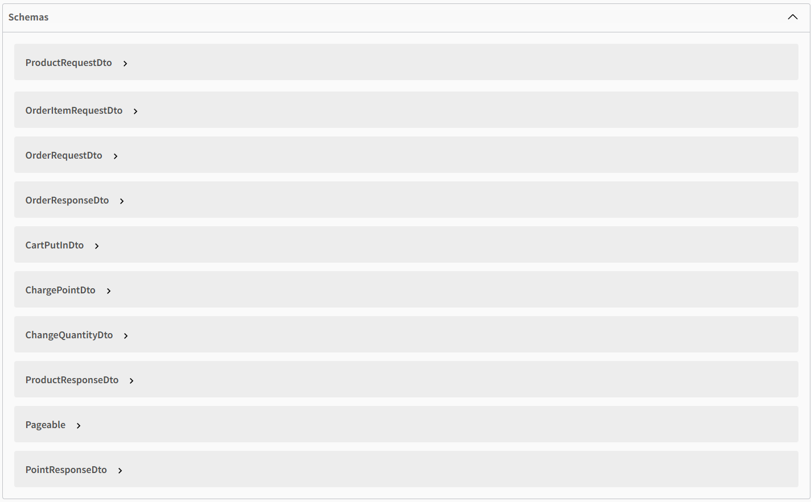

# API Specification 

## 상품

### 상품 추가

### 상품 상세 조회

### 인기 상품 조회

## 상품 목록 조회

## 주문/결제

### 상품 주문/결제

## 회원

### 회원 잔액 충전

### 회원 잔액 조회

### 장바구니 목록 조회

### 장바구니에 상품 담기

### 장바구니 상품 수량 변경

### 장바구니 상품 삭제

## 스키마
