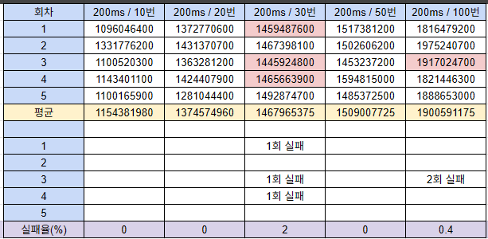
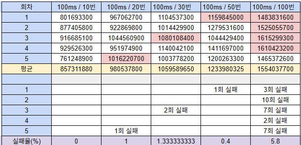
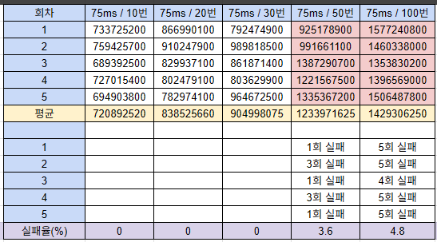
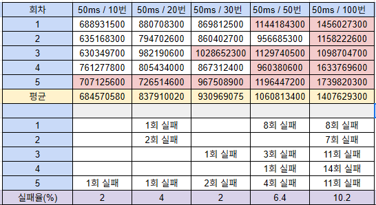
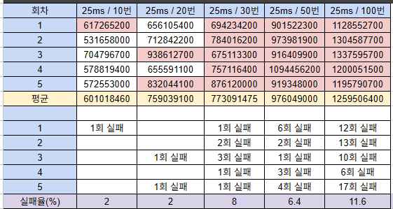
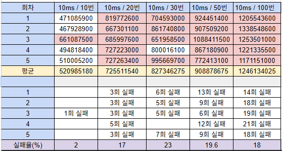
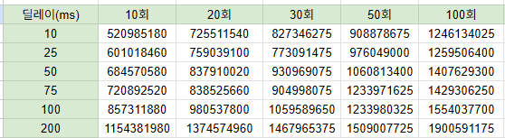
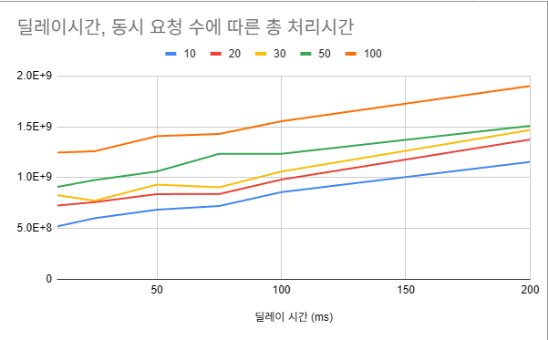

# STEP 11 보고서

## 동시성 이슈를 해결하기 위한 제어 방식

### 프로세스 락

> `synchronized`를 사용하면 프로세스가 여러개인 경우에 동시성 이슈를 해결할 수 없다.

### DB 락

> 데이터베이스에서 직접 락을 제어하는 방식

#### 비관적 락

> 자원 요청 시 동시성 이슈가 자주 발생할 것으로 예상될 때 사용하는 방식. 
> 한 트랜잭션이 데이터에 접근하고 있을 때, 다른 트랜잭션의 조회와 쓰기를 금지하는 방식. 
> 여러 테이블이 조인된 경우 데드락 발생 위험하다. 
> 동시성 이슈가 많이 발생하지 않는다면 성능이 좋지 않다.

#### 낙관적 락

> 실제 락을 사용하는 것이 아닌 Version 컬럼을 추가하여 데이터의 정합성을 맞추는 방식. 
> 동시성 이슈가 많이 발생하지 않을 것으로 판단하여 모든 요청을 락없이 처리하고 데이터 정합성 이슈가 발생할 때 롤백을 수행하여 정합성을 맞춘다. 
> 동시성 이슈가 자주 발생하면 빈번한 롤백이 발생할 수 있다.

### Redis 락

#### SETNX 명령을 활용한 스핀락

> `SETNX`는 "SET if Not Exists" 명령으로 키가 존재 하지 않을 때 값을 세팅하는 방법이다. 
> 이를 통해 특정 키를 락으로 설정하고, 락이 이미 사용 중이면 주기적으로 락을 획득하기 위해 요청하는 스핀락을 구현할 수 있다. 
> 애플리케이션은 키를 획득할 때까지 계속 요청을 시도하고, 사용이 완료되면 키를 삭제한다. 
> `SETNX`는 `deprecated`되었으므로 `SET` 명령과 NX 옵션을 사용하는 것이 권장된다. 
> 구현은 단순하지만, 락을 획득할 때까지 계속 요청을 시도하기 때문에 레디스 서버에 부하를 준다.

#### Redisson을 사용한 분산락

> Redisson은 레디스에서 분산락을 효율적으로 처리할 수 있도록 도와주는 오픈소스이다. 
> pub/sub과 Lua 스크립트를 활용해 효과적으로 분산락을 처리하는 기능을 제공한다.

**pub/sub**
> Redisson 은 레디스의 pub/sub 기능을 활용하여 락을 획득할 때까지 subscribe로 채널의 메시지를 기다린다. 
> 이후 unlock이 발생하여 채널의 메시지가 publish 되면 락 획득을 시도한다.

## 현 시스템에서 발생할 수 있는 동시성 이슈 파악

- 상품의 재고 차감
- 회원 포인트 잔액 충전 및 사용

## 구현의 복잡도, 성능, 효율성 비교

### 낙관적 락 성능 테스트

- 재시도 횟수 설정
> 재시도 횟수는 서비스에 불편함이 없어야 하고, 가능하면 요청을 최대한 처리할 수 있어야 한다. 
> 무한정 재시도를 할 경우에 모든 요청을 처리할 수 있지만 DB의 부하를 발생시킬 수 있다.

- 재시도 딜레이 시간 설정
> 딜레이를 빠르게 설정할 경우 실패율이 올라갈 수 있지만 처리 시간이 짧아질 수 있다. 
> 적절한 시간을 설정해서 처리 성공률과 처리 시간을 신경을 써야 한다.

#### 딜레이 시간, 동시 요청 수에 따른 총 처리시간 테스트

- 테스트 목적 
> 재시도 딜레이 시간 설정 
> 낙관적 락 사용 시의 처리 시간(성능) 확인

- 테스트 방법
> 잔액 충전 요청을 비동기로 n회 실행한다. 
> 총 요청 시간과 요청 성공률을 확인한다. 
> 재시도 횟수는 5회로 고정한다. 
> 동시에 요청하는 요청 수와 재시도 딜레이 시간을 변경해 가며 테스트한다. 
> 총 처리시간의 신뢰성을 높이기 위해 동시 요청 수와 딜레이 시간을 5회씩 테스트한 후 평균값을 낸 뒤 비교한다. 
> 처리되지 못하고 실패한 요청의 수를 확인하여 실패율을 확인한다. 
> 충돌이 자주 발생하지 않는 API임을 고려했을 때 요청 실패율이 낮으면 딜레이 시간을 더 낮춰서 테스트한다. 

- 테스트 과정
 

> 재시도 딜레이를 200ms 로 고정한 뒤, 동시 요청 수를 변경해 가며 테스트한 결과이다. 
> 각 시도마다 요청 실패 수를 기록하였으며 실패율이 매우 낮아 딜레이 시간을 좀 더 낮춰서 테스트 한다.
 

> 100ms로 고정한 채 테스트한 결과이다. 
> 딜레이 시간을 더 줄여도 될 정도로 실패율이 낮다고 판단된다.

> 75ms로 고정한 채 테스트한 결과이다. 
> 딜레이 시간을 더 줄여도 될 정도로 실패율이 낮다고 판단된다.

> 50ms로 고정한 채 테스트한 결과이다. 
> 100회 요청한 경우에는 실패율이 10%가 넘어가 조금 높다고 생각되지만,  
> 충돌이 적을거라 예상되는 API이기에 조금 더 딜레이 시간을 줄여본다.

> 25ms로 고정한 채 테스트한 결과이다. 
> 50ms 테스트와 마찬가지로 100회 요청한 경우에는 실패율이 10%가 넘지만 
> 같은 이유로 조금 더 딜레이 시간을 줄여도 될 것이라 판단하여 테스트를 더 진행한다.

> 10ms로 고정한 채 테스트한 결과이다. 
> 동시 요청 수를 20회로 늘렸을 때부터 실패율이 높아진다. 

  
> 딜레이 시간을 10ms, 25ms, 50ms, 75ms, 100ms, 200ms 변경했으며, 
> 동시 요청 수를 10회, 20회, 30회, 50회, 100회로 변경해가며 테스트한 결과이다. 
> 총 요청 처리 시간의 결과를 보여주고 있으며, 단위는 나노초이다.

- 테스트 결과

> 가로축은 재시도 시 딜레이 시간이고 세로축은 총 요청 처리 시간이다. 
> 딜레이 시간을 크게 잡을수록 총 요청 처리 시간이 증가하는 것을 확인할 수 있다. 
> 동시 요청 수에 따른 총 처리시간은 그래프 상단의 색깔로 확인할 수 있다. 
> 동시 요청 수가 많아질수록 총 처리시간이 길어지는 것을 확인할 수 있다. 
> 잔액 충전 API의 특성을 감안했을 때 충돌이 잦지 않을 것으로 판단된다. 
> 그리하여 동시 요청 수를 10회로 한 테스트 결과를 중심으로 판단하는 것이 합리적이라 생각한다. 

> 10회를 기준으로 보았을 때 딜레이 시간을 10ms 까지 줄였을 경우에도 실패율이 충분이 낮아서 
> 딜레이 시간을 10ms로 설정하거나 조금 더 낮춰서 사용해도 괜찮을 것으로 판단된다. 
> 잔액 충전 API의 경우에 낙관적 락을 사용하면 재시도 딜레이 시간을 10ms로, 재시도 횟수를 5회로 한다면 
> 약 0.5s 정도에 10건의 요청을 처리하는 것을 확인했다.  

### 비관적 락 성능 테스트

