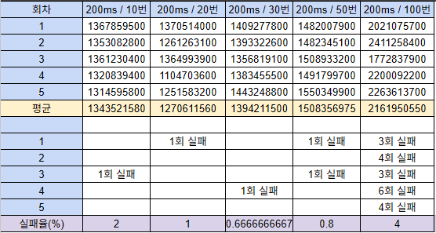
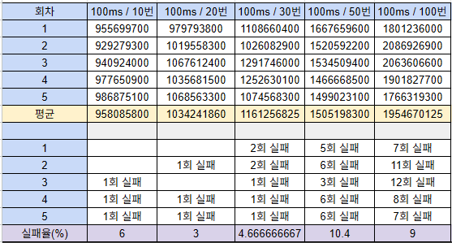
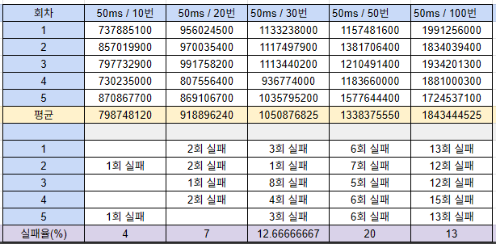
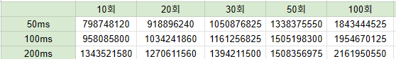
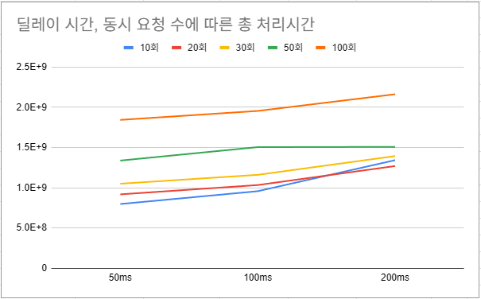
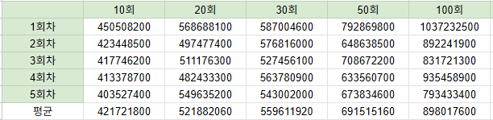
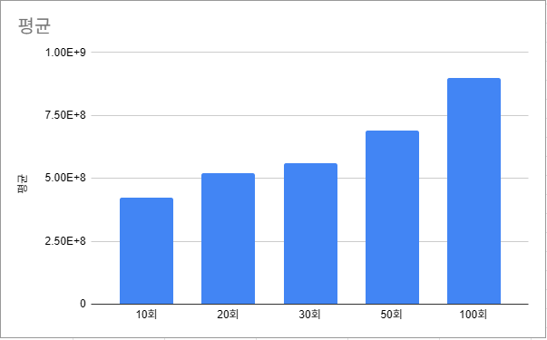
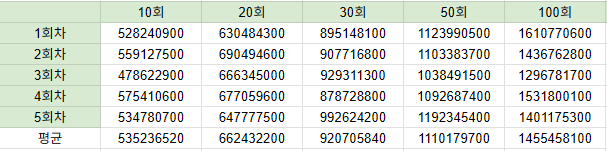
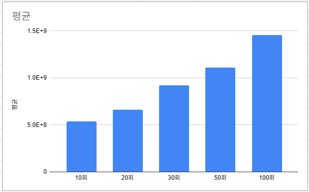

# STEP 11 보고서

## 동시성 이슈를 해결하기 위한 제어 방식

### 프로세스 락

> `synchronized`를 사용하면 프로세스가 여러개인 경우에 동시성 이슈를 해결할 수 없다.

### DB 락

> 데이터베이스에서 직접 락을 제어하는 방식

#### 비관적 락

> 자원 요청 시 동시성 이슈가 자주 발생할 것으로 예상될 때 사용하는 방식. 
> 한 트랜잭션이 데이터에 접근하고 있을 때, 다른 트랜잭션의 조회와 쓰기를 금지하는 방식. 
> 여러 테이블이 조인된 경우 데드락 발생 위험하다. 
> 동시성 이슈가 많이 발생하지 않는다면 성능이 좋지 않다.

#### 낙관적 락

> 실제 락을 사용하는 것이 아닌 Version 컬럼을 추가하여 데이터의 정합성을 맞추는 방식. 
> 동시성 이슈가 많이 발생하지 않을 것으로 판단하여 모든 요청을 락없이 처리하고 데이터 정합성 이슈가 발생할 때 롤백을 수행하여 정합성을 맞춘다. 
> 동시성 이슈가 자주 발생하면 빈번한 롤백이 발생할 수 있다.

### Redis 락

#### SETNX 명령을 활용한 스핀락

> `SETNX`는 "SET if Not Exists" 명령으로 키가 존재 하지 않을 때 값을 세팅하는 방법이다. 
> 이를 통해 특정 키를 락으로 설정하고, 락이 이미 사용 중이면 주기적으로 락을 획득하기 위해 요청하는 스핀락을 구현할 수 있다. 
> 애플리케이션은 키를 획득할 때까지 계속 요청을 시도하고, 사용이 완료되면 키를 삭제한다. 
> `SETNX`는 `deprecated`되었으므로 `SET` 명령과 NX 옵션을 사용하는 것이 권장된다. 
> 구현은 단순하지만, 락을 획득할 때까지 계속 요청을 시도하기 때문에 레디스 서버에 부하를 준다.

#### Redisson을 사용한 분산락

> Redisson은 레디스에서 분산락을 효율적으로 처리할 수 있도록 도와주는 오픈소스이다. 
> pub/sub과 Lua 스크립트를 활용해 효과적으로 분산락을 처리하는 기능을 제공한다.

**pub/sub**
> Redisson 은 레디스의 pub/sub 기능을 활용하여 락을 획득할 때까지 subscribe로 채널의 메시지를 기다린다. 
> 이후 unlock이 발생하여 채널의 메시지가 publish 되면 락 획득을 시도한다.

## 현 시스템에서 발생할 수 있는 동시성 이슈 파악

- 상품의 재고 차감
- 회원 포인트 잔액 충전 및 사용

## 성능 테스트

### 낙관적 락 성능 테스트

- 재시도 횟수 설정
> 재시도 횟수는 서비스에 불편함이 없어야 하고, 가능하면 요청을 최대한 처리할 수 있어야 한다. 
> 무한정 재시도를 할 경우에 모든 요청을 처리할 수 있지만 DB의 부하를 발생시킬 수 있다.

- 재시도 딜레이 시간 설정
> 딜레이를 빠르게 설정할 경우 실패율이 올라갈 수 있지만 처리 시간이 짧아질 수 있다. 
> 적절한 시간을 설정해서 처리 성공률과 처리 시간을 신경을 써야 한다.

- 테스트 목적 
> 재시도 딜레이 시간 설정 
> 낙관적 락 사용 시의 처리 시간(성능) 확인

- 테스트 방법
> API 요청을 비동기로 n회 실행한다. 
> 총 요청 시간과 요청 성공률을 확인한다. 
> 재시도 횟수는 5회로 고정한다. 
> 동시에 요청하는 요청 수와 재시도 딜레이 시간을 변경해 가며 테스트한다. 
> 총 처리시간의 신뢰성을 높이기 위해 동시 요청 수와 딜레이 시간을 5회씩 테스트한 후 평균값을 낸 뒤 비교한다. 
> 처리되지 못하고 실패한 요청의 수를 확인하여 실패율을 확인한다. 
> 충돌이 자주 발생하지 않는 API임을 고려했을 때 요청 실패율이 낮으면 딜레이 시간을 더 낮춰서 테스트한다. 

#### 잔액 충전 API

- 테스트 과정

> 재시도 딜레이를 200ms 로 고정한 뒤, 동시 요청 수를 변경해 가며 테스트한 결과이다. 
> 각 시도마다 요청 실패 수를 기록하였으며 실패율이 매우 낮아 딜레이 시간을 좀 더 낮춰서 테스트 한다.

> 100ms로 고정한 채 테스트한 결과이다. 
> 딜레이 시간을 더 줄여도 될 정도로 실패율이 낮다고 판단된다.

> 75ms로 고정한 채 테스트한 결과이다. 
> 딜레이 시간을 더 줄여도 될 정도로 실패율이 낮다고 판단된다.

> 50ms로 고정한 채 테스트한 결과이다. 
> 100회 요청한 경우에는 실패율이 10%가 넘어가 조금 높다고 생각되지만,  
> 충돌이 적을거라 예상되는 API이기에 조금 더 딜레이 시간을 줄여본다.

> 25ms로 고정한 채 테스트한 결과이다. 
> 50ms 테스트와 마찬가지로 100회 요청한 경우에는 실패율이 10%가 넘지만 
> 같은 이유로 조금 더 딜레이 시간을 줄여도 될 것이라 판단하여 테스트를 더 진행한다.

> 10ms로 고정한 채 테스트한 결과이다. 
> 동시 요청 수를 20회로 늘렸을 때부터 실패율이 높아진다.

  
> 딜레이 시간을 10ms, 25ms, 50ms, 75ms, 100ms, 200ms 변경했으며, 
> 동시 요청 수를 10회, 20회, 30회, 50회, 100회로 변경해가며 테스트한 결과이다. 
> 총 요청 처리 시간의 결과를 보여주고 있으며, 단위는 나노초이다.

- 테스트 결과

> 가로축은 재시도 시 딜레이 시간이고 세로축은 총 요청 처리 시간이다. 
> 딜레이 시간을 크게 잡을수록 총 요청 처리 시간이 증가하는 것을 확인할 수 있다. 
> 동시 요청 수에 따른 총 처리시간은 그래프 상단의 색깔로 확인할 수 있다. 
> 동시 요청 수가 많아질수록 총 처리시간이 길어지는 것을 확인할 수 있다. 
> 잔액 충전 API의 특성을 감안했을 때 충돌이 잦지 않을 것으로 판단된다. 
> 그리하여 동시 요청 수를 10회로 한 테스트 결과를 중심으로 판단하는 것이 합리적이라 생각한다. 

> 10회를 기준으로 보았을 때 딜레이 시간을 10ms 까지 줄였을 경우에도 실패율이 충분이 낮아서 
> 딜레이 시간을 10ms로 설정하거나 조금 더 낮춰서 사용해도 괜찮을 것으로 판단된다. 
> 잔액 충전 API의 경우에 낙관적 락을 사용하면 재시도 딜레이 시간을 10ms로, 재시도 횟수를 5회로 한다면 
> 약 0.5s 정도에 10건의 요청을 처리하는 것을 확인했다.  

#### 주문/결제 API

- 테스트 과정

> 딜레이 시간을 200ms로 고정한 채 동시 요청 수를 변경해가며 테스트한 결과이다. 
> 동시 요청 수를 100번으로 한 경우에도 실패율이 높지 않다. 

> 딜레이 시간을 100ms로 고정한 채 동시 요청 수를 변경해가며 테스트한 결과이다. 
> 200ms로 한 경우보다 실패율이 2배이상 증가했다. 
> 충돌이 잦지 않은 상황이란 걸 고려했을 때 딜레이를 좀 더 줄여서 테스트해보는 것도 의미가 있다고 판단된다.

> 딜레이 시간을 50ms 로 한 경우에는 실패율이 더 올라간 것을 확인할 수 있다. 

> 딜레이 시간을 50ms, 100ms, 200ms 변경했으며, 
> 동시 요청 수를 10회, 20회, 30회, 50회, 100회로 변경해가며 테스트한 결과이다. 
> 총 요청 처리 시간의 결과를 보여주고 있으며, 단위는 나노초이다.

> 딜레이 시간과 동시 요청 수에 따른 총 처리시간 그래프이다. 
> 딜레이 시간을 2배씩 줄이더라도 처리시간이 많이 개선되지는 않는 것을 확인했다. 
> 반면에, 동시 요청수에 따라 처리 시간이 꽤 차이가 나는 것을 확인할 수 있다. 

### 비관적 락 성능 테스트

- 테스트 목적
> 비관적 락 사용 시의 성능(처리시간) 확인

- 테스트 방법
> 동시요청 수를 10회, 20회, 30회, 50회, 100회 로 변경해가며 테스트한다. 
> 회당 5회씩 반복하여 총 요청처리시간의 평균값을 확인한다. 

#### 잔액 충전 API

- 테스트 과정

 

> 동시 요청 수에 따라 선형적으로 총 처리시간이 증가하고 있다. 

#### 주문/결제 API

- 테스트 과정

 

> 동시 요청 수에 따라 선형적으로 총 처리시간이 증가하고 있다. 
> 로직의 복잡도를 고려해보았을 때, 잔액 충전API보다 복잡한만큼 시간이 좀 더 걸리는 것으로 보인다.

### 낙관 vs 비관 비교

#### 잔액충전API
> 낙관적락(딜레이시간 10ms)과 비관적락을 10회 비동기 요청 테스트한 결과를 보았을 때 
> 낙관적락은 약 0.521초가 걸렸으며, 비관적락은 약 0.451초가 걸렸다. 

#### 주문결제API
> 낙관적락(딜레이시간 50ms)과 비관적락을 10회 비동기 요청 테스트한 결과를 보았을 때 
> 낙관적락은 약 0.799초가 걸렸으며, 비관적락은 약 0.528초가 걸렸다. 

> 두 경우 모두 처리시간으로 보면 비관적락이 더 빠르게 처리되어서 비관적락을 사용하는 것이 더 합리적이라고 볼 수 있다.

### 성능(처리시간)테스트 결론
> 이번 테스트에서 총 처리시간만 보았을 때는 비관적락을 사용하는 것이 더 합리적이라고 판단된다. 
> 하지만, API 특성상 테스트에서 진행한 것처럼 매우 빠르고 매우 많은 비동기 요청이 올 확률이 매우 낮다. 
> 프론트엔드 단에서 연속으로 요청하는 것을 막아줄 뿐더러, 사용자가 잔액을 충전하거나 같은 주문을 동시에 여러번 요청하는 경우는 거의 없기 때문이다. 
> 그런 이유로 낙관적 락을 사용해도 괜찮을 거라 판단된다.  
> 이번 테스트에서는 낙관적 락을 사용할 경우에 딜레이 시간을 어떻게 설정할 것인가에 대한 기준을 잡는 데 도움이 되었다는 점에서 의미가 있다고 생각한다. 
> 어떤 락을 사용할 것이냐의 결론을 위해서는 분산락을 포함하여 좀 더 많은 테스트와 다른 방법을 시도해 볼 필요가 있다.
> 낙관적 락을 사용할 경우에 재시도 횟수에 대해서도 생각해 보면 좋을 것 같다. 
> 재시도를 위해 부하가 얼마나 더 발생하는지도 생각해 봐야 할 것 같다. 

