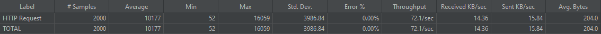

# STEP 11 보고서

## 동시성 이슈를 해결하기 위한 제어 방식

### 프로세스 락

> `synchronized`를 사용하면 프로세스가 여러개인 경우에 동시성 이슈를 해결할 수 없다.

### DB 락

> 데이터베이스에서 직접 락을 제어하는 방식

#### 비관적 락

> 자원 요청 시 동시성 이슈가 자주 발생할 것으로 예상될 때 사용하는 방식. 
> 한 트랜잭션이 데이터에 접근하고 있을 때, 다른 트랜잭션의 조회와 쓰기를 금지하는 방식. 
> 여러 테이블이 조인된 경우 데드락 발생 위험하다. 
> 동시성 이슈가 많이 발생하지 않는다면 성능이 좋지 않다.

#### 낙관적 락

> 실제 락을 사용하는 것이 아닌 Version 컬럼을 추가하여 데이터의 정합성을 맞추는 방식. 
> 동시성 이슈가 많이 발생하지 않을 것으로 판단하여 모든 요청을 락없이 처리하고 데이터 정합성 이슈가 발생할 때 롤백을 수행하여 정합성을 맞춘다. 
> 동시성 이슈가 자주 발생하면 빈번한 롤백이 발생할 수 있다.

### Redis 락

#### SETNX 명령을 활용한 스핀락

> `SETNX`는 "SET if Not Exists" 명령으로 키가 존재 하지 않을 때 값을 세팅하는 방법이다. 
> 이를 통해 특정 키를 락으로 설정하고, 락이 이미 사용 중이면 주기적으로 락을 획득하기 위해 요청하는 스핀락을 구현할 수 있다. 
> 애플리케이션은 키를 획득할 때까지 계속 요청을 시도하고, 사용이 완료되면 키를 삭제한다. 
> `SETNX`는 `deprecated`되었으므로 `SET` 명령과 NX 옵션을 사용하는 것이 권장된다. 
> 구현은 단순하지만, 락을 획득할 때까지 계속 요청을 시도하기 때문에 레디스 서버에 부하를 준다.

#### Redisson을 사용한 분산락

> Redisson은 레디스에서 분산락을 효율적으로 처리할 수 있도록 도와주는 오픈소스이다. 
> pub/sub과 Lua 스크립트를 활용해 효과적으로 분산락을 처리하는 기능을 제공한다.

**pub/sub**
> Redisson 은 레디스의 pub/sub 기능을 활용하여 락을 획득할 때까지 subscribe로 채널의 메시지를 기다린다. 
> 이후 unlock이 발생하여 채널의 메시지가 publish 되면 락 획득을 시도한다.

## 현 시스템에서 발생할 수 있는 동시성 이슈 파악

- 주문 시 상품의 재고 차감
> 공유 자원에 접근함 
> 매우 빈번히 발생함 
> 충돌 잦을 것으로 예상됨

- 회원 포인트 잔액 충전 및 사용
> 자신의 자원에만 접근함 
> 빈번하지 않게 발생함 
> 충돌이 거의 없을 것으로 예상됨

## 성능 테스트

### 테스트 목적
1. **시간당 처리량**을 확인하여 서비스를 이용하기에 충분히 편리한지 그리고 성능을 확인합니다.
2. **오류율**을 확인하여 애플리케이션 서버와 DB에 얼마나 부하를 많이 주는지 확인합니다.

### 낙관적 락 성능 테스트

- 재시도 횟수 설정 : 5회
> 재시도 횟수는 서비스에 불편함이 없어야 하고, 가능하면 요청을 최대한 처리할 수 있어야 한다. 
> 무한정 재시도를 할 경우에 모든 요청을 처리할 수 있지만 DB의 부하를 발생시킬 수 있다.

- 재시도 딜레이 시간 설정 : 50ms
> 딜레이를 빠르게 설정할 경우 실패율이 올라갈 수 있지만 처리 시간이 짧아질 수 있다. 
> 적절한 시간을 설정해서 처리 성공률과 처리 시간을 신경을 써야 한다.

#### 잔액 충전 API 테스트 결과

#### 주문/결제 API 테스트 결과

### 비관적 락 성능 테스트

#### 잔액 충전 API

#### 주문/결제 API

### 분산락 성능 테스트

#### 잔액 충전 API 테스트 결과

#### 주문/결제 API 테스트 결과
