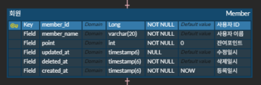
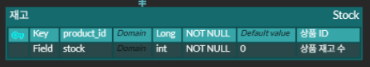
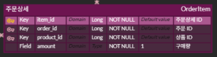
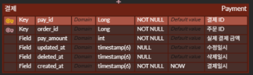
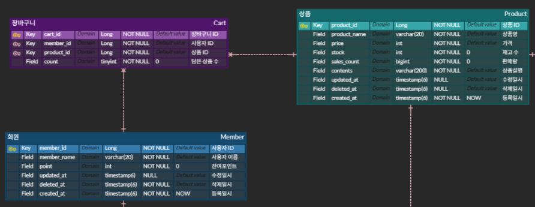
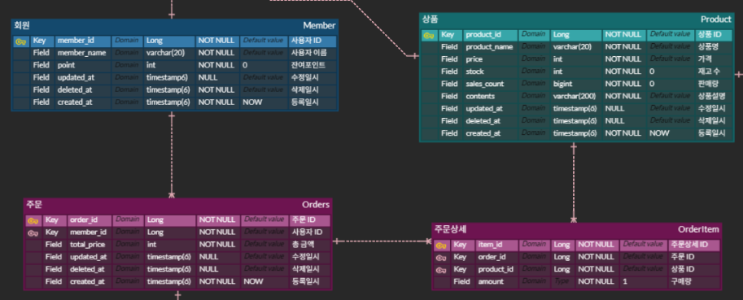

# ERD

## 엔티티

### 회원 테이블

- 사용자의 포인트를 포함한 사용자 정보를 관리하기 위한 테이블
- point : 회원의 포인트 조회를 위한 속성

### 회원의 포인트 테이블

- 회원의 포인트를 충전하는 용도로 사용하는 테이블로 포인트 충전 시 회원테이블의 point를 update해 준다.

### 상품 테이블

- 상품을 관리하기 위한 테이블
- 상품에 필요한 이미지를 사용할 경우 두가지 방법을 사용해서 확장 가능
    1. product_id를 외래키로 연결한 상품파일 테이블을 추가
    2. 상품 테이블의 속성으로 추가
- stock : 상품 재고 수 조회용 속성

### 상품 재고 테이블

- 재고 관리용 테이블
- 재고 수 수정이 이루어질 때 상품 테이블의 재고 수도 업데이트를 해 준다.

### 주문 테이블

- 주문 정보를 관리하기 위한 테이블
- 주문한 사용자를 식별하기 위해 member_id 를 외래키로 연결하여 사용
- 주문한 총 금액 속성을 추가하여 간편하게 조회할 수 있도록 함

### 주문 상세 테이블

- 각 주문 건에 해당하는 상품 목록을 관리하기 위한 테이블
- 주문 건에 종속되는 테이블이므로 order_id를 식별자로 해도 좋을 것으로 생각하지만, 실제 개발 시 외래키 연결을 하지 않을 것이므로  ERD에서는 관계만 표현함.
- 주문한 상품을 식별하기 위해 product_id 를 외래키로 연결하여 사용

### 결제 테이블

- 결제 정보를 관리하기 위한 테이블
- 주문이 있어야 결제를 할 수 있으므로 (= 종속되므로) order_id 를 외래키로 연결하여 사용
- 주문 테이블의 총 주문 금액과 실제 결제 금액이 다를 수 있으므로(추후 쿠폰이나 할인 등이 있을 수 있음) 실 결제 금액 속성을 사용

### 장바구니 테이블

- 장바구니 관리를 위한 테이블
- 장바구니에 담는 사용자를 식별하기 위해 member_id 를 외래키로 연결하여 사용
- 장바구니에 담을 상품을 식별하기 위해 product_id 를 외래키로 연결하여 사용
- 장바구니에 담을 상품의 수량을 관리하기 위해 count 속성을 사용

## 관계

### 회원 - 장바구니 - 상품

- 다수의 회원이 여러 상품을 장바구니에 담을 수 있다.
    - **회원 M : N 상품** 이며 매핑 테이블이 필요함.
    - **회원 M : 1 장바구니 1 : N 상품** 과 같이 관계를 맺도록 설계함.

### 회원 - 주문 - 주문 상세 - 상품

- 다수의 회원이 여러 상품을 주문할 수 있다.
    - **회원 1 : M 주문** 관계로 설계함.
- 하나의 주문에는 여러 주문 상품이 있을 수 있다.
    - **주문 1 : M 주문 상세** 관계로 설계함.
- 하나의 상품이 여러 주문 건에 포함될 수 있다.
    - **상품 1 : M 주문 상세** 관계로 설계함.

### 주문 - 결제

- 하나의 주문에는 하나의 결제가 이루어 진다.
    - **주문 1 : 1 결제** 관계로 설정함.
