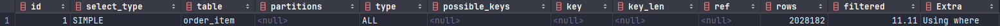
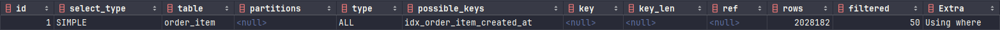
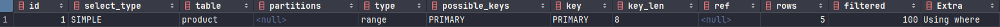
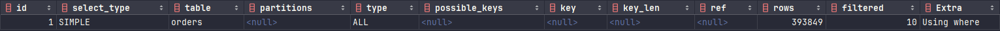
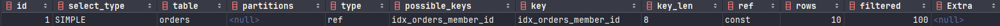
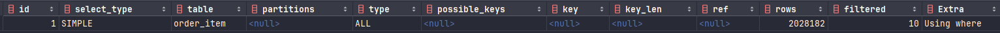
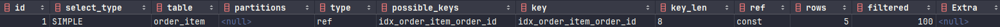
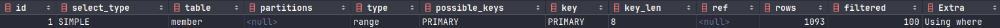

# 쿼리 성능 개선 보고서

> 현 시스템 내에서 슬로우쿼리로 의심되거나 슬로우쿼리가 될 가능성이 있는 쿼리를 확인한다.

## 쿼리 성능 비교를 위한 더미데이터 추가
> `ApplicationRunner` 를 사용하여 서버를 띄우면서 `run`메소드를 실행하도록 하여 더미데이터를 추가했으며 <br>
> 이후에 해당 코드를 제거한다.

```java
@SpringBootApplication
@RequiredArgsConstructor
public class CommerceApplication implements ApplicationRunner {

  public static void main(String[] args) {
    SpringApplication.run(CommerceApplication.class, args);
  }


  private final MemberService memberService;
  private final ProductService productService;
  private final OrderRepository orderRepository;
  private final OrderItemRepository itemRepository;
  private final CartService cartService;


  @Override
  public void run(ApplicationArguments args) throws Exception {
    for (int k = 0; k < 100000; k++) {

      int memberChargedPoint = 999999;
      String name = "hhplus";

      // 회원 추가
      Member member = memberService.joinMember(new JoinMemberDto(name + k));
      // 회원 잔액 충전
      memberService.chargePoint(new ChargePointDto(member.getId(), memberChargedPoint));

      String productName = "상품";
      int productPrice = 100;
      int productStock = 99999;
      String productDescription = "상품 설명";
      int productCount = 5;
      List<Long> productIds = new ArrayList<>();

      // 상품 추가 및 재고 설정
      for (int i = 0; i < productCount; i++) {
        Long addedProductId = productService.add(new ProductRequestDto(productName + i, productPrice, productStock, productDescription + i));
        productIds.add(addedProductId);
      }

      // 카트에 상품 담기
      for (int i = 0; i < productCount; i++) {
        cartService.putIn(new CartPutInDto(member.getId(), productIds.get(i)));
      }

      int orderCount = 10;
      int orderItemCount = 5;     // 주문 건당 아이템 수

      for (int i = 0; i < orderCount; i++) {
        Order savedOrder = orderRepository.save(new Order(member.getId(), productPrice * orderItemCount));
        for (int j = 0; j < orderItemCount; j++) {
          itemRepository.save(new OrderItem(savedOrder.getId(), productIds.get(j), 1));
        }
      }

    }
  }
}
```

---

##  현 시스템에서의 조회 쿼리

### 주문기간으로 주문 상품 조회

> 인기상품 조회 API에서 사용됨

- 쿼리

```mysql
-- 해당 기간의 주문상품을 조회하는 쿼리
SELECT *
  FROM order_item
 WHERE created_at BETWEEN '2024-11-14' AND '2024-11-15';
```

---

#### 인덱스 추가 전

- 실행 계획


  | Field         | Value     | Description               |
  | ------------- | --------- | ------------------------- |
  | select_type   | SIMPLE    | 서브쿼리나 UNION이 없음   |
  | type          | ALL       | 모든 행 스캔                |
  | possible_keys | null      | 사용할 수 있는 인덱스가 없음 |
  | key           | null      | 인덱스를 사용하지 않음       |
  | rows          | 2028182   | 처리하기 위한 row수         |
  | filtered      | 11.11     | 전체 행 수의 11.11%가 필터링됨 |
  | Extra         | Using where | where 절이 사용됨          |

- 비용
```text
-> Filter: (order_item.created_at between '2024-11-14' and '2024-11-15')  (cost=206312 rows=225331) (actual time=0.541..1897 rows=1.96e+6 loops=1)
    -> Table scan on order_item  (cost=206312 rows=2.03e+6) (actual time=0.536..1478 rows=1.96e+6 loops=1)
```

| Operation | Cost | Rows | Actual Time | Loops |
| --- | --- | --- | --- | --- |
| `Filter: ` | 206312 | 225331 | 0.541..1897 | 1 |
| `Table scan` | 206312 | 2.03e+6 | 0.536..1478 | 1 |

> where절의 활용하여 기간으로 조회할 때 풀스캔을 하기 때문에 `created_at` 속성에 인덱스를 준다면 향상될 것으로 기대된다.<br>

- 쿼리 조회 시간


---

#### 인덱스 추가

```mysql
CREATE INDEX idx_order_item_created_at ON order_item (created_at);
```

#### 인덱스 추가 후

- 실행계획



  | Field         | Value     | Description               |
  | ------------- | --------- | ------------------------- |
  | select_type   | SIMPLE    | 서브쿼리나 UNION이 없음   |
  | type          | ALL       | 모든 행 스캔                |
  | possible_keys | idx_order_item_created_at      | created_at속성에 걸린 인덱스 활용됨 |
  | key           | null      | 인덱스를 사용하지 않음       |
  | rows          | 2028182   | 처리하기 위한 row수         |
  | filtered      | 50     | 전체 행 수의 50%가 필터링됨 |
  | Extra         | Using where | where 절이 사용됨          |

- 비용

```text
-> Filter: (order_item.created_at between '2024-11-14' and '2024-11-15')  (cost=208893 rows=1.01e+6) (actual time=0.583..1886 rows=1.96e+6 loops=1)
    -> Table scan on order_item  (cost=208893 rows=2.03e+6) (actual time=0.577..1474 rows=1.96e+6 loops=1)
```

| Operation | Cost | Rows | Actual Time | Loops |
| --- | --- | --- | --- | --- |
| `Filter` | 208893 | 1.01e+6 | 0.583..1886 | 1 |
| `Table` | 208893 | 2.03e+6 | 0.577..1474 | 1 |

- 쿼리 조회 시간


---

#### 인덱스 추가 전 후 비교

  | Condition | Row Filtering | Query Execution Time |
  |-----------| --- | --- |
  | 인덱스 추가 전  | 11.11% | 84ms |
  | 인덱스 추가 후  | 50% | 107ms |

> DBMS 캐시를 비우며 여러번 실행해보았을 때 인덱스 전후로 비슷한 시간 차이를 보였으며<br>
> 현재의 데이터량으로 보았을 때 사용자 경험에 문제가 없는 거로 보아 당장의 인덱스 추가는 불필요해 보인다.<br>
> 하지만, 데이터양이 늘어난다면 추후에 인덱스 추가를 고려해볼 수 있으니 운영을 하면서 모니터링을 꾸준히 잘 해줘야 될 것으로 보인다.<br>

- 추가로 고려할 점

> 현재 인기 상품 조회 API는 캐시를 사용하고 있으며, 하루에 한번씩 실행되는 쿼리라는 것을 감안했을 때 인덱스 추가는 좀 더 지켜보는 것이 좋겠다고 판단하였다.

---

### 회원 ID로 장바구니에 담긴 상품 조회

- 쿼리

```mysql
-- 여러 상품의 정보를 조회하는 쿼리
SELECT *
  FROM product
 WHERE product_id IN (251, 252, 253, 254, 255);
```

- 실행 계획



  | Field         | Value   | Description            |
    | ------------- | ------- |------------------------|
  | select_type   | SIMPLE  | 서브쿼리나 UNION이 없음        |
  | type          | range     | 범위 스캔                  |
  | possible_keys | PRIMARY    | 사용할 수 있는 인덱스로는 기본키가 있음 |
  | key           | PRIMARY    | 인덱스 사용함                |
  | rows          | 8      | 처리하기 위한 row수           |
  | filtered      | 100   | 전체 행 수 100%가 필터링됨      |
  | Extra         | Using where | where 절이 사용됨           |

- 비용
```text
-> Filter: (product.id in (251,252,253,254,255))  (cost=5.89 rows=5) (actual time=0.023..0.0295 rows=5 loops=1)
    -> Index range scan on product using PRIMARY over (id = 251) OR (id = 252) OR (3 more)  (cost=5.89 rows=5) (actual time=0.0221..0.0282 rows=5 loops=1)
```

| Operation | Cost | Rows | Actual Time | Loops |
| --- |------|------|-------------| --- |
| `Filter: ` | 5.89    | 5    | 0.023..0.0295           | 1 |
| `Table scan` | 5.89    | 5    | 0.023..0.0295           | 1 |

- 쿼리 실행 시간


> 기본키 인덱스를 활용하여 효율적으로 쿼리가 실행된 것으로 보이며 실행시간도 사용자 경험에 문제가 없을 정도로 판단되어  인덱스 추가는 고려하지 않는다.

---

### 회원 ID로 주문정보 조회

- 쿼리

```mysql
SELECT *
  FROM orders
 WHERE member_id = 243;
```

---

#### 인덱스 추가 전

- 실행 계획



  | Field         | Value       | Description       |
    | ------------- |-------------|-------------------|
  | select_type   | SIMPLE      | 서브쿼리나 UNION이 없음   |
  | type          | ALL         | 모든 행 스캔           |
  | possible_keys | null        | 사용할 수 있는 인덱스가 없음  |
  | key           | null        | 인덱스를 사용하지 않음      |
  | rows          | 393849      | 처리하기 위한 row수      |
  | filtered      | 10           | 전체 행 수의 10%가 필터링됨 |
  | Extra         | Using where | where 절이 사용됨      |

- 비용

```text
-> Filter: (orders.member_id = 243)  (cost=39794 rows=39385) (actual time=106..108 rows=10 loops=1)
    -> Table scan on orders  (cost=39794 rows=393849) (actual time=0.581..95.7 rows=392661 loops=1)

```

| Operation | Cost | Rows | Actual Time | Loops |
| --- |------|------|-------------| --- |
| `Filter: ` | 39794    | 39385    | 106..108           | 1 |
| `Table scan` | 39794   | 393849    | 0.581..95.7           | 1 |

- 쿼리 실행 시간


---

#### 인덱스 추가

```mysql
CREATE INdEX idx_orders_member_id ON orders (member_id);
```

#### 인덱스 추가 후

- 실행 계획



| Field         | Value                | Description                    |
|---------------|----------------------|--------------------------------|
| select_type   | SIMPLE               | 서브쿼리나 UNION이 없음                |
| type          | ref                  | 모든 행 스캔                        |
| possible_keys | idx_orders_member_id | 사용할 수 있는 인덱스가 있음               |
| key           | idx_orders_member_id | 인덱스를 사용함                       |
| rows          | 10                   | 처리하기 위한 row수                   |
| ref           | const                | 유니크하여 조회된 행 수가 0이거나 1임. 매우 효율적 |
| filtered      | 100                  | 전체 행 수의 100%가 필터링됨             |

- 비용

```text
-> Index lookup on orders using idx_orders_member_id (member_id = 243)  (cost=3.5 rows=10) (actual time=0.0374..0.0398 rows=10 loops=1)
```

| Operation | Cost | Rows | Actual Time | Loops |
| --- |------|------|-------------| --- |
| `Index lookup: ` | 3.5    | 10    | 0.0374..0.0398           | 1 |


- 쿼리 실행 시간


#### 인덱스 추가 전 후 비교

  | Condition | Scan Type | Key Used             | Rows    | Filtered | Cost  | Ref    | Query Execution Time |
  |-----------|-----------|----------------------|---------|----------|-------|--------|--------| 
  | 인덱스 추가 전  | ALL       | NULL                 | 393849  | 10%      | 39794 | NULL   | 340ms |
  | 인덱스 추가 후  | ref       | idx_orders_member_id | 10      | 100%     | 3.5   | const  | 78ms |

> 인덱스 추가 후에 `scan type`이 ALL 에서 ref로 바뀌었으며 rows 수가 크게 감소하였다.<br>
> 그리고 필터링된 row의 비율이 10%에서 100%로 향상되었다.<br>
> 추가로 ref가 null에서 const로 바뀌면서 쿼리 비용도 크게 감소하였다.<br>
> 쿼리 실행 시간을 비교했을 때도 340ms에서 78ms 로 개선되었다.<br>
> 위 결과로 보았을 때 쿼리 성능이 크게 향상된 것으로 판단된다.<br>
> 현재 사용자 경험에는 크게 문제가 있는 상황은 아니어서 인덱스 추가가 필수적인 상황은 아니라고 판단된다.<br>
> 인덱스를 추가하지 않는다면 계속적인 모니터링을 통해 문제가 발생하는지 주의깊게 관찰할 필요가 있어보인다.

---

### 주문 ID에 대한 주문상세 정보 조회

- 쿼리

```mysql
SELECT *
  FROM order_item
 WHERE order_id = 4543;
```

#### 인덱스 추가 전

- 실행 계획


  | Field         | Value       | Description       |
    | ------------- |-------------|-------------------|
  | select_type   | SIMPLE      | 서브쿼리나 UNION이 없음   |
  | type          | ALL         | 모든 행 스캔           |
  | possible_keys | null        | 사용할 수 있는 인덱스가 없음  |
  | key           | null        | 인덱스를 사용하지 않음      |
  | rows          | 2028182     | 처리하기 위한 row수      |
  | filtered      | 10          | 전체 행 수의 10%가 필터링됨 |
  | Extra         | Using where | where 절이 사용됨      |

- 비용

```text
-> Filter: (order_item.order_id = 4543)  (cost=207265 rows=202818) (actual time=5.81..1663 rows=5 loops=1)
    -> Table scan on order_item  (cost=207265 rows=2.03e+6) (actual time=0.603..1607 rows=1.96e+6 loops=1)
```

| Operation | Cost | Rows | Actual Time | Loops |
|-----------|------|------|-------------|-------|
| `Filter` | 207265 rows=202818 | 5.81 | 1663 | 1 |
| `Table scan` | 207265 rows=2.03e+6 | 0.603 | 1607 | 1 |

- 실행 시간


---

#### 인덱스 추가

```mysql
CREATE INDEX idx_order_item_order_id ON order_item (order_id);
```

#### 인덱스 추가 후

- 실행 계획



| Field         | Value                   | Description                    |
|---------------|-------------------------|--------------------------------|
| select_type   | SIMPLE                  | 서브쿼리나 UNION이 없음                |
| type          | ref                     | 모든 행 스캔                        |
| possible_keys | idx_order_item_order_id | 사용할 수 있는 인덱스가 있음               |
| key           | idx_order_item_order_id | 인덱스를 사용함                       |
| rows          | 8                       | 처리하기 위한 row수                   |
| ref           | const                   | 유니크하여 조회된 행 수가 0이거나 1임. 매우 효율적 |
| filtered      | 100                     | 전체 행 수의 100%가 필터링됨             |

- 비용
```text
-> Index lookup on order_item using idx_order_item_order_id (order_id = 4543)  (cost=4.67 rows=5) (actual time=0.445..0.448 rows=5 loops=1)
```

| Operation | Cost | Rows | Actual Time | Loops |
| --- |------|------|-------------| --- |
| `Index lookup` | 4.67    | 5    | 0.445..0.448           | 1 |

- 쿼리 실행 시간


#### 인덱스 추가 전 후 비교

| Condition | Scan Type | Key Used                   | Rows    | Filtered | Cost   | Ref    | Query Execution Time |
|-----------|-----------|----------------------------|---------|----------|--------|--------|----------------------|
| 인덱스 추가 전  | ALL       | NULL                       | 2028182 | 10%      | 207265 | NULL   | 1.894s               |
| 인덱스 추가 후  | ref       | idx_order_item_order_id    | 8       | 100%     | 4.67   | const  | 63ms                 |

> memberId로 조회할 때와 비슷한 결과를 나타내었다.<br>
> 인덱스 추가 후에 `scan type`이 ALL 에서 ref로 바뀌었으며 rows 수가 크게 감소하였다.<br>
> 그리고 필터링된 row의 비율이 10%에서 100%로 향상되었다.<br>
> 추가로 ref가 null에서 const로 바뀌면서 쿼리 비용도 크게 감소하였다.<br>
> 쿼리 실행 시간을 비교했을 때도 1.894s에서 63ms 로 개선되었다.<br>
> 위 결과로 보았을 때 쿼리 성능이 크게 향상된 것으로 판단된다.<br>
> 인덱스 추가 전에는 사용자 경험에 문제가 있는 것으로 판단되어 인덱스를 추가하는 것이 좋을거라 판단하였다.

---

#### 회원 ID로 회원정보 조회

```mysql

```

- 실행 계획


  | Field         | Value     | Description        |
    | ------------- | --------- |--------------------|
  | select_type   | SIMPLE    | 서브쿼리나 UNION이 없음    |
  | type          | range       | 범위 스캔              |
  | possible_keys | PRIMARY      | 기본키 인덱스 사용가능       |
  | key           | PRIMARY      | 인덱스를 사용            |
  | rows          | 1093      | 처리하기 위한 row수       |
  | filtered      | 100     | 전체 행 수의 100%가 필터링됨 |
  | Extra         | Using where | where 절이 사용됨       |

- 비용
```text
-> Filter: (0 <> `member`.member_id)  (cost=220 rows=1093) (actual time=0.038..0.407 rows=1092 loops=1)
    -> Index range scan on member using PRIMARY over (member_id < 0) OR (0 < member_id)  (cost=220 rows=1093) (actual time=0.0368..0.348 rows=1092 loops=1)
```

| Operation | Cost | Rows | Actual Time | Loops |
| --- |------|------|-------------| --- |
| `Filter: ` | 220    | 1093    | 0.038..0.407           | 1 |
| `Index range scan` | 220    | 1093    | 0.0368..0.348           | 1 |

- 쿼리 실행 시간


> 기본키 인덱스를 잘 활용하여 효율적으로 조회한 것으로 판단된다.

---