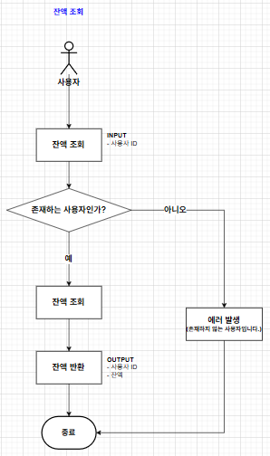

# 1. 시나리오 : e-커머스 서비스

## 서비스 설명
- 상품 주문에 필요한 메뉴 정보들을 구성하고 조회가 가능해야 합니다.
- 사용자는 상품을 여러개 선택해 주문할 수 있고, 미리 충전한 잔액을 이용합니다.
- 상품 주문 내역을 통해 판매량이 가장 높은 상품을 추천합니다.

## 필수 요건
- 아래 4가지 API 를 구현합니다.
  - 잔액 충전 / 조회 API
  - 상품 조회 API
  - 주문 / 결제 API
  - 인기 판매 상품 조회 API
- 각 기능 및 제약사항에 대해 단위 테스트를 반드시 하나 이상 작성하도록 합니다.
- 다수의 인스턴스로 어플리케이션이 동작하더라도 기능에 문제가 없도록 작성하도록 합니다.
- 동시성 이슈를 고려하여 구현합니다.
- 재고 관리에 문제 없도록 구현합니다.

---

# 2. 마일스톤

---

# 3. 요구조건

## 상품 조회
- 사용자는 상품 목록을 조회할 수 있다.
  - 상품은 20개씩 조회된다.
  - 조회 시 정보는 상품 번호, 상품명, 재고 수, 상품 등록일시
- 사용자는 상품 하나에 대한 상세 조회를 할 수 있다.
  - 조회 시 정보는 상품 번호, 상품명, 재고 수, 상품 등록일시, 상품 설명
- 사용자는 3일간 인기 판매 상품을 5위까지 조회할 수 있다.

## 잔액 충전/조회
- 사용자는 잔액을 충전할 수 있다.
  - 충전 금액은 양수여야 한다.
  - 충전 금액은 한 번에 100만원까지 가능하다.
- 사용자는 자신의 잔액을 조회할 수 있다.
  - 충전 내역이 없는 사용자는 0원으로 조회된다.

## 주문 / 결제
- 사용자는 상품을 주문할 수 있다.
  - 개별 상품을 구매할 수 있다.
  - 장바구니에 담은 상품은 한 번에 구매할 수 있다.
  - 상품은 재고 수보다 많이 구매할 수 없다.
  - 구매할 상품의 수는 양수여야 한다.

## 장바구니
- 사용자는 상품을 장바구니에 담을 수 있다.
  - 하나의 상품을 선택하고 개수를 정하여 담을 수 있다.
  - 상품은 한 번에 10개까지 담을 수 있다.
- 사용자는 자신의 장바구니에 담긴 상품 목록을 조회할 수 있다.
  - 조회 시 정보는 상품 번호, 상품명, 담은 수량, 재고 수, 상품 등록일시
- 사용자는 장바구니에 담긴 상품을 제거할 수 있다.
  - 여러 상품을 한 번에 제거할 수 있다.
- 사용자는 장바구니에 담긴 상품의 개수를 변경할 수 있다.

## 기타
- 데이터 플랫폼으로 주문정보 전송한다.

---

# 4. 플로우 차트
## 상품 목록 조회 / 인기 상품 조회

## 상품 상세 조회

## 잔액 충전

## 잔액 조회

## 상품 주문 / 결제

## 장바구니 상품 수량 변경

## 장바구니에 담긴 상품 조회

## 장바구니에 담은 상품 삭제

---

