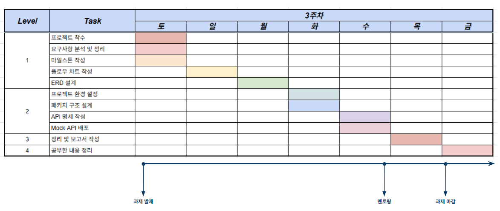

# 1. 시나리오 : e-커머스 서비스

## 서비스 설명
- 상품 주문에 필요한 메뉴 정보들을 구성하고 조회가 가능해야 합니다.
- 사용자는 상품을 여러개 선택해 주문할 수 있고, 미리 충전한 잔액을 이용합니다.
- 상품 주문 내역을 통해 판매량이 가장 높은 상품을 추천합니다.

## 필수 요건
- 아래 4가지 API 를 구현합니다.
  - 잔액 충전 / 조회 API
  - 상품 조회 API
  - 주문 / 결제 API
  - 인기 판매 상품 조회 API
- 각 기능 및 제약사항에 대해 단위 테스트를 반드시 하나 이상 작성하도록 합니다.
- 다수의 인스턴스로 어플리케이션이 동작하더라도 기능에 문제가 없도록 작성하도록 합니다.
- 동시성 이슈를 고려하여 구현합니다.
- 재고 관리에 문제 없도록 구현합니다.

---

# 2. 마일스톤


---

# 3. 요구조건

## 상품 조회
- 사용자는 상품 목록을 조회할 수 있다.
  - 상품은 20개씩 조회된다.
  - 조회 시 정보는 상품 번호, 상품명, 재고 수, 상품 등록일시
- 사용자는 상품 하나에 대한 상세 조회를 할 수 있다.
  - 조회 시 정보는 상품 번호, 상품명, 재고 수, 상품 등록일시, 상품 설명
- 사용자는 3일간 인기 판매 상품을 5위까지 조회할 수 있다.

## 잔액 충전/조회
- 사용자는 잔액을 충전할 수 있다.
  - 충전 금액은 양수여야 한다.
  - 충전 금액은 한 번에 100만원까지 가능하다.
- 사용자는 자신의 잔액을 조회할 수 있다.
  - 충전 내역이 없는 사용자는 0원으로 조회된다.

## 주문 / 결제
- 사용자는 상품을 주문할 수 있다.
  - 개별 상품을 구매할 수 있다.
  - 장바구니에 담은 상품은 한 번에 구매할 수 있다.
  - 상품은 재고 수보다 많이 구매할 수 없다.
  - 구매할 상품의 수는 양수여야 한다.

## 장바구니
- 사용자는 상품을 장바구니에 담을 수 있다.
  - 하나의 상품을 선택하고 개수를 정하여 담을 수 있다.
  - 상품은 한 번에 10개까지 담을 수 있다.
- 사용자는 자신의 장바구니에 담긴 상품 목록을 조회할 수 있다.
  - 조회 시 정보는 상품 번호, 상품명, 담은 수량, 재고 수, 상품 등록일시
- 사용자는 장바구니에 담긴 상품을 제거할 수 있다.
  - 여러 상품을 한 번에 제거할 수 있다.
- 사용자는 장바구니에 담긴 상품의 개수를 변경할 수 있다.

## 기타
- 데이터 플랫폼으로 주문정보 전송한다.

---

# 4. 플로우 차트
## 상품 목록 조회 / 인기 상품 조회


## 상품 상세 조회


## 잔액 충전


## 잔액 조회


## 상품 주문 / 결제


## 장바구니 상품 수량 변경


## 장바구니에 담긴 상품 조회


## 장바구니에 담은 상품 삭제


---

# 5. ERD


## 엔티티

### 회원 테이블


- 사용자의 포인트를 포함한 사용자 정보를 관리하기 위한 테이블
- point : 회원의 포인트 조회를 위한 속성

### 회원의 포인트 테이블


- 회원의 포인트를 충전하는 용도로 사용하는 테이블로 포인트 충전 시 회원테이블의 point를 update해 준다.

### 상품 테이블


- 상품을 관리하기 위한 테이블
- 상품에 필요한 이미지를 사용할 경우 두가지 방법을 사용해서 확장 가능
    1. product_id를 외래키로 연결한 상품파일 테이블을 추가
    2. 상품 테이블의 속성으로 추가
- stock : 상품 재고 수 조회용 속성

### 상품 재고 테이블


- 재고 관리용 테이블
- 재고 수 수정이 이루어질 때 상품 테이블의 재고 수도 업데이트를 해 준다.

### 주문 테이블


- 주문 정보를 관리하기 위한 테이블
- 주문한 사용자를 식별하기 위해 member_id 를 외래키로 연결하여 사용
- 주문한 총 금액 속성을 추가하여 간편하게 조회할 수 있도록 함

### 주문 상세 테이블


- 각 주문 건에 해당하는 상품 목록을 관리하기 위한 테이블
- 주문 건에 종속되는 테이블이므로 order_id를 식별자로 해도 좋을 것으로 생각하지만, 실제 개발 시 외래키 연결을 하지 않을 것이므로  ERD에서는 관계만 표현함.
- 주문한 상품을 식별하기 위해 product_id 를 외래키로 연결하여 사용

### 결제 테이블


- 결제 정보를 관리하기 위한 테이블
- 주문이 있어야 결제를 할 수 있으므로 (= 종속되므로) order_id 를 외래키로 연결하여 사용
- 주문 테이블의 총 주문 금액과 실제 결제 금액이 다를 수 있으므로(추후 쿠폰이나 할인 등이 있을 수 있음) 실 결제 금액 속성을 사용

### 장바구니 테이블


- 장바구니 관리를 위한 테이블
- 장바구니에 담는 사용자를 식별하기 위해 member_id 를 외래키로 연결하여 사용
- 장바구니에 담을 상품을 식별하기 위해 product_id 를 외래키로 연결하여 사용
- 장바구니에 담을 상품의 수량을 관리하기 위해 count 속성을 사용

## 관계

### 회원 - 장바구니 - 상품


- 다수의 회원이 여러 상품을 장바구니에 담을 수 있다.
    - **회원 M : N 상품** 이며 매핑 테이블이 필요함.
    - **회원 M : 1 장바구니 1 : N 상품** 과 같이 관계를 맺도록 설계함.

### 회원 - 주문 - 주문 상세 - 상품


- 다수의 회원이 여러 상품을 주문할 수 있다.
    - **회원 1 : M 주문** 관계로 설계함.
- 하나의 주문에는 여러 주문 상품이 있을 수 있다.
    - **주문 1 : M 주문 상세** 관계로 설계함.
- 하나의 상품이 여러 주문 건에 포함될 수 있다.
    - **상품 1 : M 주문 상세** 관계로 설계함.

### 주문 - 결제


- 하나의 주문에는 하나의 결제가 이루어 진다.
    - **주문 1 : 1 결제** 관계로 설정함.

---

# API 명세서

## 상품

### 상품 목록 조회

- HTTP Method : GET
- Path : localhost:8080/api/products/all
- Request : No Parameters
- Response : 200 
  - 예시 : 
```html
[
  {
    "productId": 1,
    "name": "Product 1",
    "price": 100,
    "stock": 50,
    "description": "Description 1",
    "deletedAt": null,
    "updatedAt": "2024-10-11T03:19:34.9733854",
    "createdAt": "2024-10-11T03:19:34.9733854"
  },
  {
    "productId": 2,
    "name": "Product 2",
    "price": 200,
    "stock": 100,
    "description": "Description 2",
    "deletedAt": null,
    "updatedAt": "2024-10-11T03:19:34.9733854",
    "createdAt": "2024-10-11T03:19:34.9733854"
  },
  {
    "productId": 3,
    "name": "Product 3",
    "price": 300,
    "stock": 150,
    "description": "Description 3",
    "deletedAt": null,
    "updatedAt": "2024-10-11T03:19:34.9733854",
    "createdAt": "2024-10-11T03:19:34.9733854"
  },...
]
```
- Error : X
- Authorization : X

### 인기 상품 목록 조회

- HTTP Method : GET
- Path : localhost:8080/api/products/bestsellers
- Request : No Parameters
- Response : 200
  - 예시 :
```html
[
  {
    "productId": 1,
    "name": "Product 1",
    "price": 100,
    "stock": 50,
    "description": "Description 1",
    "deletedAt": null,
    "updatedAt": "2024-10-11T03:19:34.9733854",
    "createdAt": "2024-10-11T03:19:34.9733854"
  },
  {
    "productId": 2,
    "name": "Product 2",
    "price": 200,
    "stock": 100,
    "description": "Description 2",
    "deletedAt": null,
    "updatedAt": "2024-10-11T03:19:34.9733854",
    "createdAt": "2024-10-11T03:19:34.9733854"
  },
  {
    "productId": 3,
    "name": "Product 3",
    "price": 300,
    "stock": 150,
    "description": "Description 3",
    "deletedAt": null,
    "updatedAt": "2024-10-11T03:19:34.9733854",
    "createdAt": "2024-10-11T03:19:34.9733854"
  },...
]
```
- Error : X
- Authorization : X

### 상품 상세 조회

- HTTP Method : GET
- Path : localhost:8080/api/products/{productId}
- Request : product_id
- Response : 200
  - 예시 :
```html
[
  {
    "productId": 1,
    "name": "Product 1",
    "price": 100,
    "stock": 50,
    "description": "Description 1",
    "deletedAt": null,
    "updatedAt": "2024-10-11T03:19:34.9733854",
    "createdAt": "2024-10-11T03:19:34.9733854"
  }
]
```
- Error : X
- Authorization : X

## 회원 포인트

### 회원 포인트 충전

- HTTP Method : POST
- Path : localhost:8080/api/member/points
- Request :
  - 예시 :
```html
{
    "memberId":"2",
    "points":"300"
}
```
- Response : 200
- Error : X
- Authorization : X

### 회원 포인트 조회

- HTTP Method : GET
- Path : localhost:8080/api/member/{memberId}/points
- Request :
- Response : 200
  - 예시 :
```html
{
    "memberId": 1,
    "point": 100
}
```
- Error : X
- Authorization : X

## 주문

### 상품 주문

- HTTP Method : POST
- Path : localhost:8080/api/order
- Request :
  - 예시 :
```html
{
  "memberId":2,
  "products": [1, 2, 3, 4, 5]
}
```
- Response : 200
  - 예시 :
```html
{
  "orderId": 1,
  "memberId": 2,
  "productId": 3,
  "totalPrice": 1000
}
```
- Error : X
- Authorization : X

## 결제

- HTTP Method : POST
- Path : localhost:8080/api/pay
- Request :
  - 예시 :
```html
{
  "memberId":2,
  "orderId": 4
}
```
- Response : 200
  - 예시 :
```html
{
  "payId": 1
}
```
- Error : X
- Authorization : X

## 장바구니

### 장바구니에 상품 담기

- HTTP Method : POST
- Path : localhost:8080/api/member/cart/products
- Request :
  - 예시 :
```
{
  "memberId":2,
  "productId": 4
}
```
- Response : 200
- Error : X
- Authorization : X

### 장바구니에서 상품 삭제

- HTTP Method : DELETE
- Path : localhost:8080/api/member/cart/products
- Request : No Parameters
- Response : 200
- Error : X
- Authorization : X

### 장바구니에 담긴 상품 목록 조회

- HTTP Method : GET
- Path : localhost:8080/api/member/{memberId}/cart/products
- Request : No Parameters
- Response : 200
  - 예시 :
```html
[
  {
    "productId": 1,
    "name": "Product 1",
    "price": 100,
    "stock": 50,
    "description": "Description 1",
    "deletedAt": null,
    "updatedAt": "2024-10-11T03:54:28.938402",
    "createdAt": "2024-10-11T03:54:28.938402"
  },
  {
    "productId": 2,
    "name": "Product 2",
    "price": 200,
    "stock": 49,
    "description": "Description 2",
    "deletedAt": null,
    "updatedAt": "2024-10-11T03:54:28.938402",
    "createdAt": "2024-10-11T03:54:28.938402"
  }
]
```
- Error : X
- Authorization : X

### 장바구니에 있는 상품의 수량 변경

- HTTP Method : PATCH
- Path : localhost:8080/api/member/products
- Request :
  - 예시 :
```html
{
  "memberId":2,
  "productId": 4,
  "quantity": 5
}
```
- Response : 200
- Error : X
- Authorization : X

---

# 패키지 구조

```html

ㄴapplication
  ㄴservice
    ㄴCarttService
    ㄴMembertService
    ㄴOrderService
    ㄴProductService
ㄴdomain
// 도메인 객체와 db매핑 엔티티를 분리
  ㄴentity
    ㄴCart
    ㄴMember
    ㄴOrder
    ㄴOrderItem
    ㄴPay
    ㄴProducdt
  ㄴrepository
    ㄴCartRepository
    ㄴMemberRepository
    ㄴOrderItemRepository
    ㄴOrderRepository
    ㄴPayRepository
    ㄴProductRepository
// 정책을 세워서 값을 사용할 경우에 사용
  ㄴpolicy
    ㄴConst
ㄴinfra
// DB 매핑용 엔티티
  ㄴentity
    ㄴCartEntity
    ㄴMemberEntity
    ㄴOrderEntity
    ㄴOrderItemEntity
    ㄴPayEntity
    ㄴProductEntity
ㄴpresentation
  ㄴcontroller
    ㄴCartController
    ㄴMemberController
    ㄴOrderController
    ㄴProductController
  -dto
    ㄴCartDto
    ㄴMemberDto
    ㄴOrderDto
    ㄴOrderItemDto
    ㄴPayDto
    ㄴProductDto
    ...

```

위와 같은 구조로 패키지 구조를 설계했습니다.


